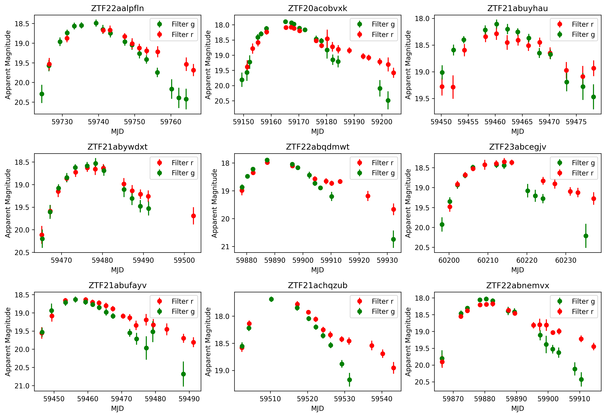
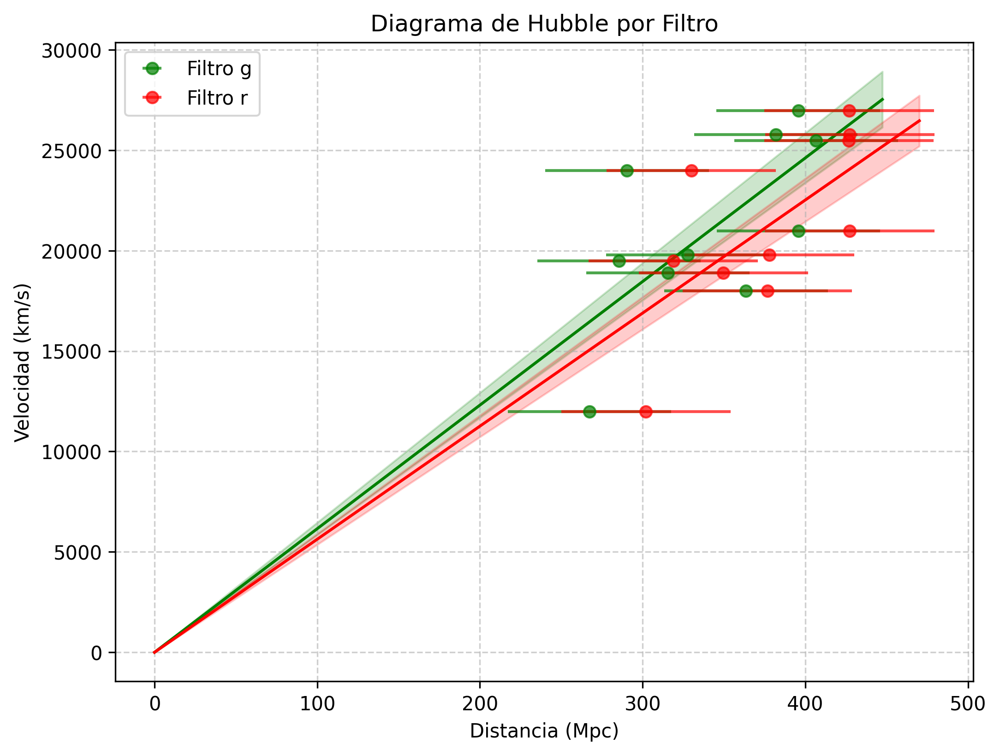

# Cosmólogos por un Día. Determinando el valor de $H_0$ usando Supernovas tipo Ia

> La actividad puede ser encontrarse a continuación: [Actividad.pdf](main.pdf) 

Las supernovas (SN) son explosiones energéticas de estrellas en las últimas etapas de su vida. Se clasifican en dos tipos generales: las de colapso de núcleo (producidas por estrellas de alta masa) y las de colapso termonuclear o Tipo Ia.

Observaciones detalladas de SN han sido cruciales para el descubrimiento de la expansión acelerada del universo, la comprensión de la formación de elementos pesados y la estimación de distancias a galaxias lejanas. El hecho de por qué las supernovas Tipo Ia pueden ser usadas como candelas estándar para medir distancias se debe a que, al ser producidas por el mismo mecanismo de explosión termonuclear al alcanzar la Masa de Chandrasekhar ($1.4M_\odot$), poseen una luminosidad intrínseca muy similar. Este brillo aparente se mide a través de curvas de luz, que muestran la variación del brillo en función del tiempo.

Al obtener el punto máximo de brillo en la curva de luz de una supernova Tipo Ia y el redshift de su galaxia anfitriona, es posible calcular la distancia a la supernova y, a partir de una muestra significativa, estimar la constante de Hubble ($H_0$) usando la relación distancia-luminosidad.

El volumen de datos generado por surveys como el Zwicky Transient Facility (ZTF) y el futuro Vera C. Rubin Observatory (LSST) hace indispensable el uso de técnicas de Machine Learning para la clasificación. Para esto fue creado ALeRCE (Automatic Learning for the Rapid Classification of Events, [Förster et al. 2021](https://ui.adsabs.harvard.edu/abs/2021AJ....161..242F/abstract)), un broker astronómico chileno.

## Objetivos
- Familiarizarse con la herramienta Explorer de ALeRCE para analizar curvas de luz de supernovas obtenidas por el ZTF.

- Identificar curvas de luz de supernovas tipo Ia.

- Extraer el máximo de brillo aparante ($m$) de las curvas de luz y el redshift de la galaxia anfitriona.

- Realizar el cálculo de la constante de Hubble $H_0$ usando la relación de distancia-luminosidad usando la regrsión lineal entre la distancia y el redshift.

- Discutir las fuentes de error en la estimación de $H_0$.

## Datos
En este ejercicio se uso datos públicos del telescopio ZTF usando el broker ALeRCE para extraer los datos. Específicamente una muestra de supernovas Tipo Ia con curvas de luz en los filtros $g$ y $r$, junto con sus redshifts y distancias estimadas a partir de la luz de la galaxia anfitriona.

El subconjunto de datos que fue usado en este ejercicio puede ser visto aquí:

## Resultados
Se obtuvo el valor de la constante de Hubble usando los datos de supernovas Tipo Ia en los filtros $g$ y $r$:

| Filtro | $H_0$ (km/s/Mpc) | Incer | Error |
|:------:|:----------------:|:-----:|:-----:|
|   g    | 61.54            | 5.2   | 15%   |
|   r    | 56.31            | 4.9   | 23%   |

Usando como referencia el valor de $H_o = 73.04 \pm 1.04 \, \text{km s}^{−1}\text{Mpc}^{−1}$
(Refencia), se observa que los valores obtenidos están por debajo del valor aceptado, aunque dentro de un rango razonable considerando las fuentes de error involucradas en el análisis.

El gráfico de dispersión de velocidad vs distancia para ambos filtros se muestra a continuación:

## Referencias
- Förster, F., Cabrera-Vives, G., Castillo-Navarrete, E., Estévez, P. A., Sánchez-Sáez, P., et al. (2021). The Automatic Learning for the Rapid Classification of Events (ALeRCE) Alert Broker., 161(5):242.

- Hubble, E. (1929). A relation between distance and radial velocity among extra-galactic nebulae. Proceedings of the National Academy of Sciences, 15(3):168–173.

- Riess, A. G., Yuan, W., Macri, L. M., Scolnic, D., Brout, D., Casertano, S., Jones, D. O., Murakami, Y., Anand, G. S., Breuval, L., Brink, T. G., Filippenko, A. V., Hoffmann, S., Jha, S. W., D’arcy Kenworthy, W., Mackenty, J., Stahl, B. E., and Zheng, W. (2022). A comprehensive measurement of the local value of the hubble constant with 1 km s1 mpc1 uncertainty from the hubble space telescope and the sh0es team. The Astrophysical Journal Letters, 934(1):L7.

- Sánchez-Sáez, P., Reyes, I., Valenzuela, C., Förster, F., Eyheramendy, S., Elorrieta, F., Bauer, F. E., Cabrera-Vives, G., Estévez, P. A., Catelan, M., Pignata, G., Huijse, P., De Cicco, D., Arévalo, P., Carrasco-Davis, R., Abril, J., Kurtev, R., Borissova, J., Arredondo, J., Castillo-Navarrete, E., Rodriguez, D., Ruz-Mieres, D., Moya, A., Sabatini-Gacitúa, L., Sepúlveda-Cobo, C., and Camacho-Iñiguez, E. (2021). Alert Classification for the ALeRCE Broker System: The Light Curve Classifier. , 161(3):141.